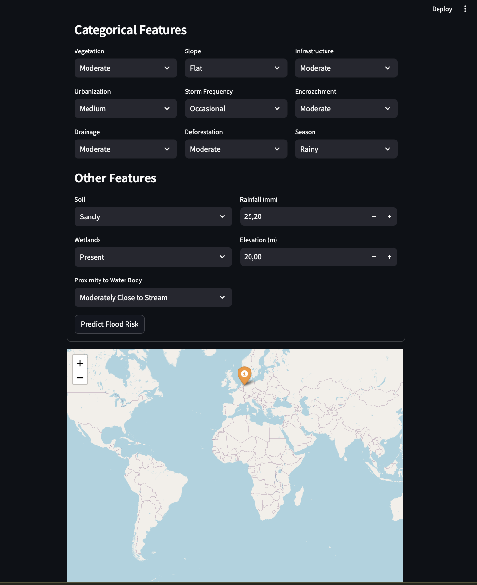

# 🌊 Flood Risk Prediction Model 🌧️



## 📝 Overview
Welcome to the **Flood Risk Prediction Model**! 🚨 This project leverages machine learning to predict flood risk based on environmental features like elevation, rainfall, soil type, and proximity to water bodies. It includes a training script (`cmodel_1.py`), a **FastAPI** backend (`api.py`), and a **Streamlit** frontend (`frontend.py`) with an interactive map 🗺️ for a seamless user experience. Ideal for researchers, developers, or anyone interested in flood risk assessment! 😄

## 🎯 Features
- **Interactive Map** 🗺️: Click on a world map in the Streamlit app to select a location (latitude/longitude).
- **Auto-Filled Data** 🌍: Fetches data for features like:
  - **Elevation** 📏: From Open-Meteo API.
  - **Rainfall** ☔: 7-day rainfall sum (Open-Meteo).
  - **Soil Type** 🌱: From SoilGrids API (Clay, Sandy, Loamy, Rocky).
  - **Proximity to Water Body** 🏞️: Uses Overpass API (OSM) to classify distance to rivers, streams, lakes, lagoons, or dams (e.g., "Very Close to River").
  - **Wetlands** 🌿: Checks for wetlands within 1km (Overpass API).
  - **Slope** ⛰️: Approximates slope using elevation differences at nearby points.
  - **Season** 🌞: Auto-set based on month and hemisphere (Rainy, Dry, Transition).
- **Manual Inputs** ✍️: Selectboxes for Vegetation, Urbanization, etc., with defaults (e.g., "Moderate").
- **Prediction** 🔍: Uses the FloodNet model (via `api.py` or `cmodel_1.py`) to predict flood risk (None, Low, Medium, High).
- **Map Visualization** 🎨: Marks the selected location with a color-coded marker (🟥 High, 🟧 Medium, 🟩 Low, ⬜ None).
- **API Backend** ⚙️: FastAPI serves predictions and valid category options.
- **No API Keys Needed** 🔓: Uses free, public APIs for data fetching.

## 🛠️ Setup
Follow these steps to set up the project on **Windows**, **macOS**, or **Linux** using **Python 3.11**. 🚀

### Prerequisites
- **Python 3.11**: Required for compatibility with dependencies (e.g., `contourpy==1.3.2`, `torch==2.2.2`).
- **Git**: To clone the repository.
- **pip**: For installing dependencies.

### 1. Clone the Repository 📂
Clone the project and navigate to the directory:
```bash
git clone https://github.com/opeblow/flood-risk-prediction-model.git
cd flood-risk-prediction-model
```

### 2. Install Python 3.11
Ensure Python 3.11 is installed. Follow platform-specific instructions:

#### **Windows**
1. Download Python 3.11 from [python.org](https://www.python.org/downloads/release/python-3119/) or use winget:
   ```cmd
   winget install Python.Python.3.11
   ```
2. Verify installation:
   ```cmd
   python --version
   ```
   It should show `Python 3.11.x`. If not, ensure `C:\Python311` (or your install path) is in your system PATH:
   - Open "Environment Variables" (search in Windows settings).
   - Add `C:\Python311;C:\Python311\Scripts` to the `Path` variable.

#### **macOS**
1. Install Python 3.11 using Homebrew:
   ```bash
   brew install python@3.11
   ```
2. Verify installation:
   ```bash
   /usr/local/bin/python3.11 --version
   ```
   It should show `Python 3.11.x`. Add to PATH if needed:
   ```bash
   echo 'export PATH="/usr/local/bin:$PATH"' >> ~/.zshrc
   source ~/.zshrc
   ```

#### **Linux (Ubuntu/Debian)**
1. Install Python 3.11:
   ```bash
   sudo apt update
   sudo apt install python3.11 python3.11-venv python3.11-dev
   ```
2. Verify installation:
   ```bash
   python3.11 --version
   ```
   It should show `Python 3.11.x`.

### 3. Create and Activate a Virtual Environment
Create a Python 3.11 virtual environment to isolate dependencies.

#### **Windows**
```cmd
python -m venv venv
venv\Scripts\activate
```

#### **macOS/Linux**
```bash
python3.11 -m venv venv
source venv/bin/activate
```

After activation, your prompt should show `(venv)`. Verify Python version:
```bash
python --version
```
It should show `Python 3.11.x`.

### 4. Install Dependencies 📦
Upgrade `pip` and install dependencies from `requirements.txt`:
```bash
pip install --upgrade pip
pip install -r requirements.txt
```

**Note**: The `requirements.txt` includes:
- `torch==2.2.2`, `torchvision==0.17.2`, `torchaudio==2.2.2`
- `numpy<2.0` (for PyTorch compatibility)
- `pillow==10.4.0` (resolves Streamlit conflict)
- `packaging==24.1` (resolves Streamlit/limits conflict)
- `streamlit==1.39.0`, `fastapi==0.115.12`, `uvicorn==0.34.3`
- Other dependencies for data processing and visualization (e.g., `pandas`, `folium`, `requests`)

If you encounter dependency conflicts, ensure `requirements.txt` matches the provided version in the project.

### 5. Prepare Data and Model 📁
Ensure the following files are in the project root:
- `flood_risk_dataset_final.csv`: Contains environmental data for training.
- `best_floodnet_model.pth`: Pre-trained FloodNet model weights, saved by `cmodel_1.py`.

### 6. Run the Application 🚀
Use the `start.sh` script to launch the FastAPI backend and Streamlit frontend.

#### **Windows**
The `start.sh` script uses Bash, which isn’t native to Windows. Use Git Bash, WSL, or run the commands manually:
1. Start FastAPI:
   ```cmd
   uvicorn api:app --host 0.0.0.0 --port 9000
   ```
2. In a separate terminal (with `venv` activated), start Streamlit:
   ```cmd
   streamlit run frontend.py --server.port 8501
   ```

#### **macOS/Linux**
1. Make `start.sh` executable:
   ```bash
   chmod +x start.sh
   ```
2. Fix line endings (if needed, due to Windows-style `\r\n`):
   ```bash
   sed -i '' 's/\r$//' start.sh
   ```
3. Run the script:
   ```bash
   ./start.sh
   ```

This starts:
- **FastAPI**: `http://localhost:9000`
- **Streamlit**: `http://localhost:8501` (opens in your browser)

## 📚 Usage
1. **Open the Streamlit App** 🌐:
   Navigate to `http://localhost:8501`.
2. **Interact with the Map** 🗺️:
   - Click a location to capture latitude and longitude.
   - The app fetches environmental data (e.g., elevation, rainfall).
3. **Review Auto-Filled Form** ✍️:
   - Auto-updates with fetched values (e.g., Soil, Wetlands, Proximity).
   - Adjust Vegetation, Urbanization, etc., via selectboxes.
4. **Predict Flood Risk** 🔍:
   - Click "Predict Flood Risk" to submit.
   - Displays predicted risk (None, Low, Medium, High) with probabilities.
5. **Visualize on Map** 🎨:
   - Marks the location with a color-coded marker (🟥 High, 🟧 Medium, 🟩 Low, ⬜ None).
6. **API Access** ⚙️:
   - Use `http://localhost:9000`:
     - `POST /predict`: Send feature data for predictions.
     - `GET /valid_options`: Get valid input categories.

## 📍 Model Saving
The best model is saved as `best_floodnet_model.pth` in the project root (`flood-risk-prediction-model/`) by `cmodel_1.py` during training. It’s loaded by `api.py` or `frontend.py` for predictions.

## 📝 Notes
- **API Details** 🌐:
  - **Open-Meteo**: Elevation and 7-day rainfall sum (10k calls/day limit).
  - **SoilGrids**: Soil composition at 0-5cm (Clay, Sandy, Loamy, Rocky).
  - **Overpass API (OSM)**: Water bodies (within 5km) and wetlands (within 1km).
  - **Season**: Based on month and hemisphere (simplified for tropics).
  - **Slope**: Approximated from elevation differences (~100m offsets).
- **Limitations** ⚠️:
  - Rainfall uses recent 7-day data; historical data (e.g., World Bank Climate) could improve accuracy.
  - Slope calculation is approximate; high-resolution DEM APIs could help.
  - Vegetation, Urbanization use manual inputs; auto-filling requires paid APIs (e.g., Google Earth Engine).
  - API rate limits apply; cache results for production.
  - Map markers persist in session state; clear manually if needed.
- **Potential Improvements** 🚀:
  - Integrate advanced APIs for Vegetation, Urbanization.
  - Use historical rainfall data.
  - Improve slope calculation with DEM data.
  - Add caching for API calls.
  - Enable saving predictions or exporting visualizations.
  - Deploy to cloud platforms (e.g., AWS, Heroku).
- **Model Details** 🧠:
  - FloodNet is a neural network trained on `flood_risk_dataset_final.csv`.
  - Features are preprocessed (e.g., clipping, log transformation, encoding).
  - Outputs probabilities for None, Low, Medium, High via softmax.

## 🙌 Contributing
Contributions are welcome! 😊 Fork the repo, enhance features (e.g., API integrations, UI/UX, model performance), and submit a pull request.

## 📬 Contact
For questions, use [GitHub Issues](https://github.com/opeblow/flood-risk-prediction-model) or contact [raimonvibe](https://about.me/raimonvibe). 📧

## 🔗 Credits
Built with ❤️ using [opeblow/flood-risk-prediction-model](https://github.com/opeblow/flood-risk-prediction-model). Enhanced with map integration and API auto-fill by Grok, created by xAI. 🚀

